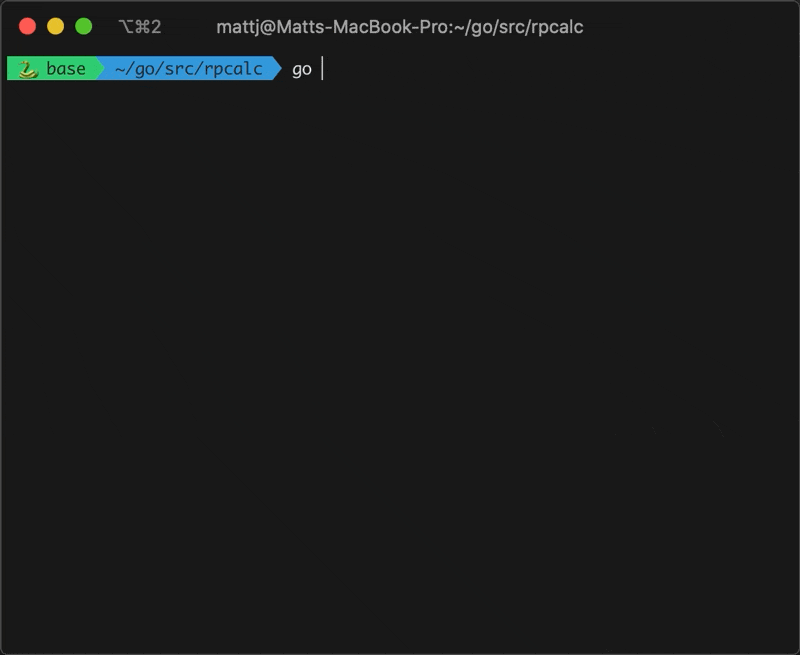

# RPN Calc

RPN Calc is a calculator that evaluates expressions written in
[Reverse Polish notation](https://en.wikipedia.org/wiki/Reverse_Polish_notation) (Postfix).
This calculator is rather simplistic but supports addition, subtraction, multiplication, division, and basic
trigonometry functions (sin, tan, cos).

## Table of Contents

* [Requirements](#requirements)
* [Usage](#usage)
* [Example](#example)
* [Supported Syntax](#supported-syntax)
* [Building RPN Calc](#building-rpn-calc)

## Requirements

* [Golang 1.15+](https://golang.org/dl)

## Usage

To run the calculator enter the following command:

```go run cmd/main.go```

Once the application is started, it will prompt you to enter an equation. 
Simply, enter an equation in [Reverse Polish notation](https://en.wikipedia.org/wiki/Reverse_Polish_notation) 
and press enter.

## Example



## Supported Syntax

* Simple arithmetic operations (e.g., `+`, `-`, `*`, `/`)
* Simple trigonometric functions (e.g., `sin`, `cos`, `tan`)
* Grouping of expressions using parentheses
* Application of the above on a list of operands (e.g., `(3.141 (2 3 +) (1.571 sin) *)`) 

## Building RPN Calc

RPN Calc can be compiled into an executable using Golang.

To compile RPN Calc into an executable run the following command:

`go build -o rpncalc cmd/main.go`
